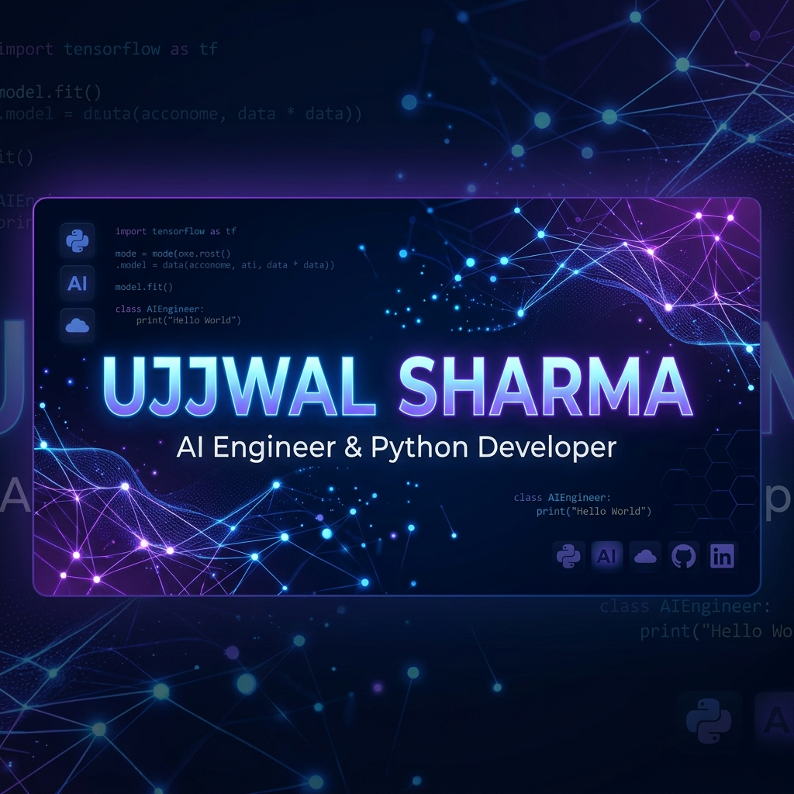

<p align="center">
  
</p>

<p align="center">
  
</p>

<p align="center">
  <a href="https://github.com/usharma24"></a>
  
  
</p>

<p align="center">
  <a href="https://www.linkedin.com/in/ujjwal-d-sharma/"></a>
  <a href="https://github.com/usharma24"></a>
</p>

---

## ⚡ System Overview

<table align="center" width="100%">
  <tr>
    <td width="50%"><b>👤 Profile:</b> AI Engineer & Python Developer</td>
    <td width="50%"><b>🎓 Education:</b> Integrated M.Sc. in Information Technology</td>
  </tr>
  <tr>
    <td width="50%"><b>🧠 Core Focus:</b> Computer Vision | GenAI | Deep Learning</td>
    <td width="50%"><b>⚙️ Backend:</b> FastAPI | Flask | Scalable Microservices</td>
  </tr>
  <tr>
    <td width="50%"><b>☁️ Infrastructure:</b> AWS | Docker | MLOps Pipelines</td>
    <td width="50%"><b>🎯 Availability:</b> Seeking Internships & Placements</td>
  </tr>
</table>

---

## 🛠️ Stack & Technologies

### 💻 Core Languages
<p align="left">
  
  
  
  
  
  
</p>

### 🧠 Artificial Intelligence & Deep Learning
<p align="left">
  
  
  
  
  
  
  
</p>

### ⚙️ Backend Engineering
<p align="left">
  
  
  
</p>

### ☁️ Infrastructure & Database
<p align="left">
  
  
  
  
  
  
  
</p>

---

## 🏆 Featured Projects

<div align="center">

| Project | Description | Core Stack | Link |
| :--- | :--- | :--- | :--- |
| **🚀 AutoMind** | Automated data profiling and machine learning analysis platform. | `Python` `Pandas` `ML` | [Source](https://github.com/usharma24) |
| **📦 IMS** | Enterprise-grade inventory management and asset tracking system. | `Flask` `Python` `SQL` | [Source](https://github.com/usharma24) |
| **🤖 Career Coach** | AI-driven mentorship and personalized career progression mapping. | `GenAI` `Gemini` `Python` | [Source](https://github.com/usharma24) |
| **👋 Gesture Control** | Real-time computer vision system recognizing hand gestures. | `OpenCV` `Python` `CV` | [Source](https://github.com/usharma24) |
| **🚗 Vehicle OCR** | Automated License Plate Detection and character processing. | `YOLO` `OpenCV` `OCR` | [Source](https://github.com/usharma24) |

</div>

---

## 🏅 Credentials & Education

* 🎓 **Integrated M.Sc. IT Student** — *Deep learning specialization*
* 🧠 **Google Cloud** — *Create Your First Gemini Enterprise Application (AI Skill Badge)*
  <br/>
  
  <br/><br/>
* ☁️ **AWS Training & Certification** — *Foundations of Prompt Engineering (June 2026)*
  <br/>
  
  <br/><br/>
* 💻 **Microsoft Learn** — *Explore and analyze data with Python (June 2026)*
  <br/>
  
  <br/><br/>
* 🚀 **Microsoft & Simplilearn** — *Introduction to Copilot for Startups (June 2026)*
  <br/>
  
  <br/><br/>
* 📊 **Deloitte (via Forage)** — *Data Analytics Job Simulation (June 2026)*
  <br/>
  
  <br/><br/>
* ☁️ **AWS Educate Certified** — *Cloud infrastructure deployment*
* 📊 **IBM SkillsBuild Certified** — *Advanced data modeling*
* 🏆 **Microsoft Learn** — *Enterprise systems certification*

---

## 📊 Developer Analytics Dashboard

<p align="center">
  
  
</p>

<p align="center">
  
</p>

<p align="center">
  
</p>

<p align="center">
  
  
</p>

<p align="center">
  
  
</p>

---

## 📈 Contribution Performance Graph

<p align="center">
  
</p>

---

## 🐍 Contribution Snake

```html

